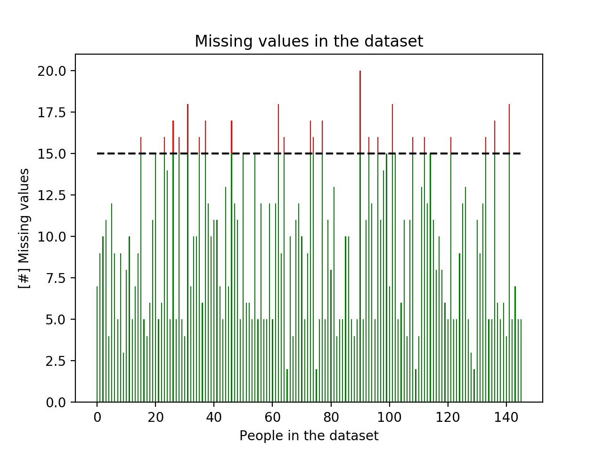
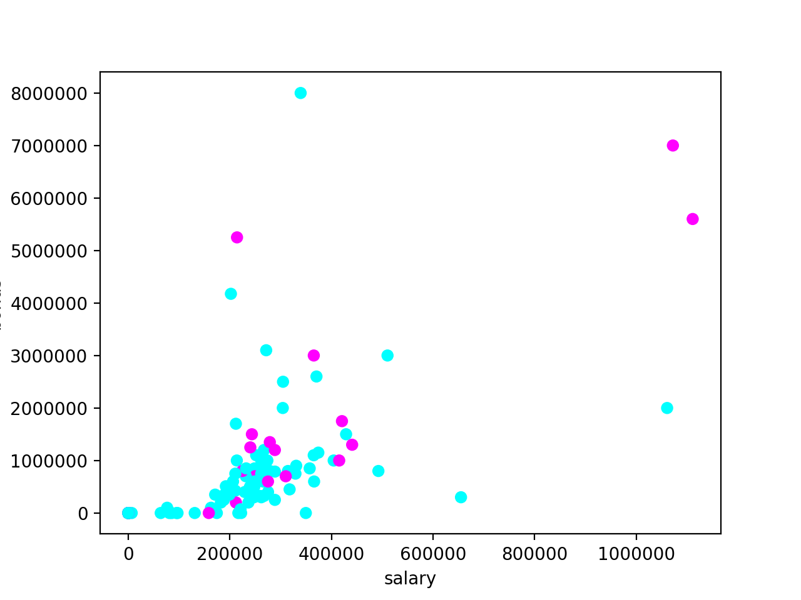
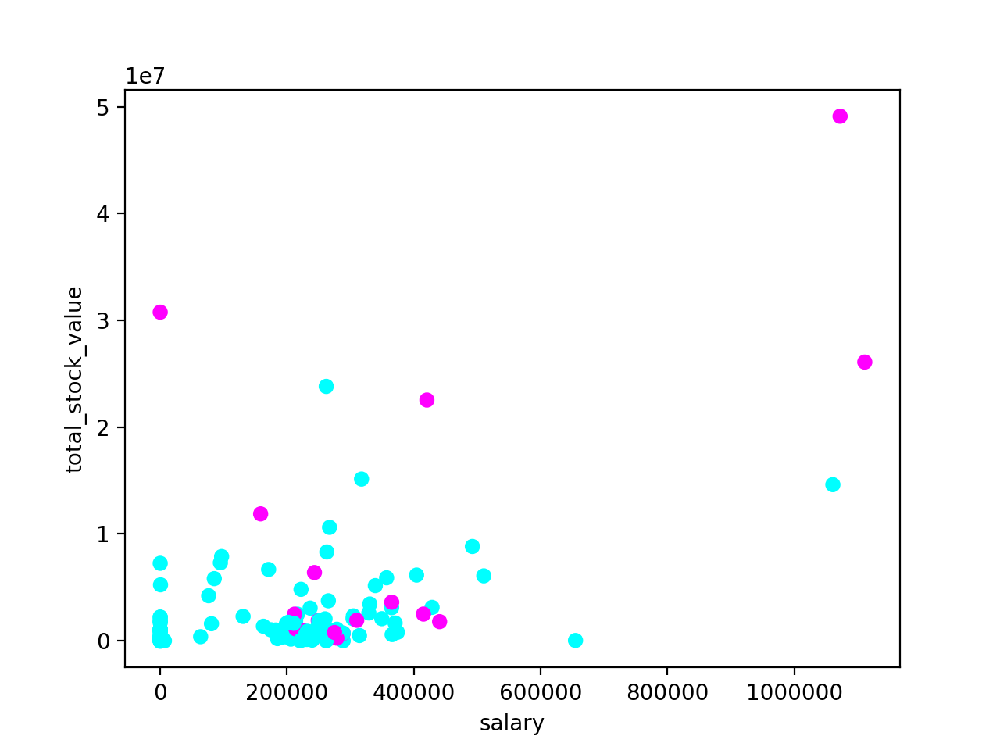
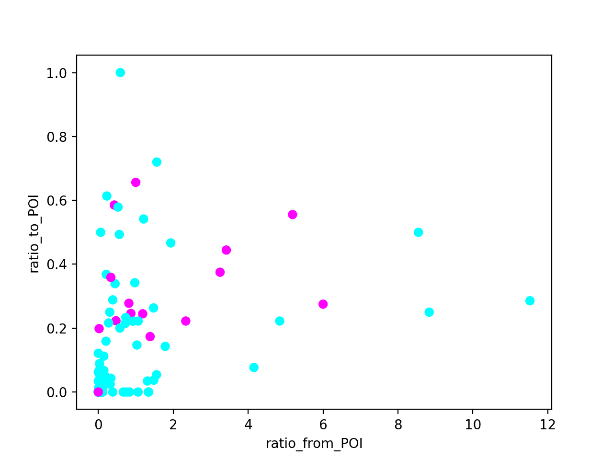

Readme
======

Project Details
---------------

**Project Overview**

In 2000, Enron was one of the largest companies in the United States. By 2002, it had collapsed into bankruptcy due 
to widespread corporate fraud. In the resulting Federal investigation, a significant amount of typically confidential 
information entered into the public record, including tens of thousands of emails and detailed financial data for top 
executives. The aim of this project is to create a person of interest identifier based on financial and email data 
made public as a result of the Enron scandal. A dataset containing this data with a hand-generated list of persons of 
interest in the fraud case, which means individuals who were indicted, reached a settlement or plea deal with the 
government, or testified in exchange for prosecution immunity.

Code
------------------------------

**Code functionality**
The project has been run using Python 3.6. It consists of 2 executables that are contained in the identpoi folder.
- poi_id.py: it is the main executable for the analysis. It creates the poi_id.log, some figures for the data exploration, 
and the final dataset and model.
- tester.py: it is the tester provided with the project adapted to Python 3.6

**Usability**
- poi_id.py can be run to export the dataset, list of features and algorithm, so that the final algorithm can be 
checked easily using tester.py

Understanding the Dataset
-------

**Data Exploration**

This section will answer to the first questions arising from the data exploration.
The data are created with the poi_id script and registered in the poi_id.log
First of all it is important to check the size of the dataset and the number of features.
The dataset consists of 146 samples. For each sample there are 21 features. The number of POI out of the 146 samples is 18,
that means that the dataset is imbalanced. 

Some of the features have a lot of missing values has can be seen from the below figure:
 


It has been decided to take out from the analysis the samples missing more than 15 features.
This means that LOWRY CHARLES P, CHAN RONNIE, WODRASKA JOHN, URQUHART JOHN A, WHALEY DAVID A, MENDELSOHN JOHN, 
CLINE KENNETH W, WAKEHAM JOHN, WROBEL BRUCE, MEYER JEROME J, GATHMANN WILLIAM D, GILLIS JOHN, LOCKHART EUGENE E,
PEREIRA PAULO V. FERRAZ, BLAKE JR. NORMAN P, THE TRAVEL AGENCY IN THE PARK, CHRISTODOULOU DIOMEDES, WINOKUR JR. HERBERT S, 
YEAP SOON, FUGH JOHN L, SCRIMSHAW MATTHEW, SAVAGE FRANK, GRAMM WENDY L will be eliminated from the dataset.
None of them is a POI. 

**Outlier Investigation**

The next step is to look for the outliers. The first step was to check the maximum and the minimum value for each feature within the
samples. It was easy to spot that the maximum was always the TOTAL, being the last line of the pdf with the financial data.
TOTAL has been removed from the dataset.

The following plot have been created to see whether there was an easy correlation between the financial figures or the emails
sent or received from a POI and being a POI.





The images show that there is no an easy correlation and some of the extremes are actually POIs. This means that we will need
to use some machine learning algorithms to find hyper-dimensional correlations.


Feature Engineering
--------

**New features**

Looking at the last figure of the previous section it is impossible to see a clear trend between the mails sent or received from POIs and
being a POI. This statistics could be polluted by the number of the emails sent or received.
In example sending 10 mails out of 15 to a POI, should count more than sending 20 out of 200. 

For this reason 3 new features have been created and added to the dataset:
- interaction_POI: the ratio between the emails sent to or received from a POI and the emails sent and received
- ratio_from_POI: the ratio between the emails received from a POI and the emails received
- ratio_to_POI: the ratio between the emails sent to a POI and the emails sent

The plot when using the ratio is shown below. It is possible to observe a slight improvement on the data.


It was decided to carry on with all the features and to use the PCA in order to diminish the size of the problem.

Machine Learning Algorithm
--------------

Steps of the Model

For the model creation 3 steps have been considered:
- Feature scaling: standardization of a dataset is a common requirement for many machine learning estimators: they might behave badly if 
the individual features do not more or less look like standard normally distributed data 
(e.g. Gaussian with 0 mean and unit variance). This is the case for the ENRON dataset, hence the first stop of our 
algorithm has to be a scaling of the features. It was decided to use the StandardScaler.
- Principal component analysis (PCA): As explained in the previous section it was decided not to reduce the features 
used for the model. A PCA on all the features was performed instead in order to reduce the size of the model losing as
little information as possible.
- Classifier: As requested 3 classifier have been tried. SVM, Decision Tree and KNeighborsClassifier.

Parameter tuning
It is not time to choose the hyper-parameters and train the model with the training set. Each classifier has a set of parameters that
can be chosen. The choice of these parameters along with the training set are the key for a good model.
In order to try different combination of the hyper-parameters GridSearchCV will be used.


To concatenate the 3 steps a pipeline has been used and the parameter exploration has been performed with GridSearchCV.


The considered parameter space is:
```python
param_space = {
    SVC: [
        {
            'pca__n_components': [5, 10, 12],
            'clf__kernel': ['sigmoid', 'rbf'],
            'clf__C': [1, 10, 100, 1000],
            'clf__gamma': ['scale'],
        }
    ],
    DecisionTreeClassifier: [
        {
            'pca__n_components': [5, 10, 12],
            'clf__criterion': ['gini', 'entropy'],
            'clf__min_samples_split': [2, 4, 6, 8],
            'clf__max_depth': [2, 5, None],
        }
    ],
    KNeighborsClassifier: [
        {
            'pca__n_components': [5, 10, 12],
            'clf__n_neighbors': [2, 3, 5, 8],
            'clf__weights': ['distance', 'uniform'],
            'clf__algorithm': ['kd_tree', 'ball_tree', 'auto']
        }
    ],
}
```

The samples have been separated in the train (80% of the samples) and the test (20% of the samples) sets. Due to the fact that the 
2 classes are very imbalanced StratifiedShuffleSplit is used to create training and test sets. The cross-validation has 
been used in the training set amongst the GridSearchCV parameters.

Validate and Evaluate
-------

The different classifiers have been evaluated in terms of precision and recall, and the one having the best score with
the parameters used was the SVM.

The precision is defined as the ratio between the true positives and the total number of positive predictions. The recall
is defined as the ratio between the true positives and the sum of true positives and false negatives.
The recall is important in this case because for the poi identification it would be good to have as less false negatives
as possible keeping a good precision.

The complete pipeline has been saved and passed along the dataset and the feature list to the tester. The tester will re-train
and check the precision and recall metrics. 
The results obtained with the tester are:

    Accuracy: 0.79385	Precision: 0.33716	Recall: 0.35200	F1: 0.34442	F2: 0.34893
	Total predictions: 13000	True positives:  704	False positives: 1384	False negatives: 1296	True negatives: 9616

